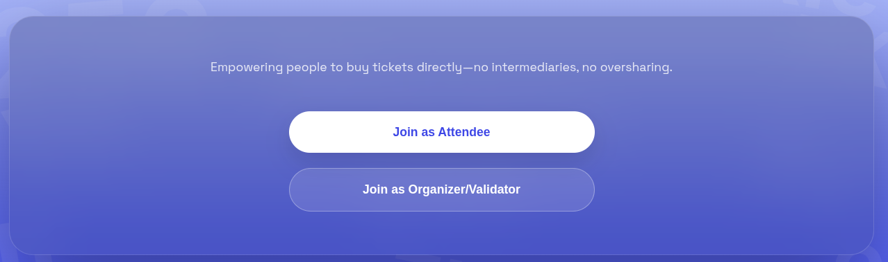
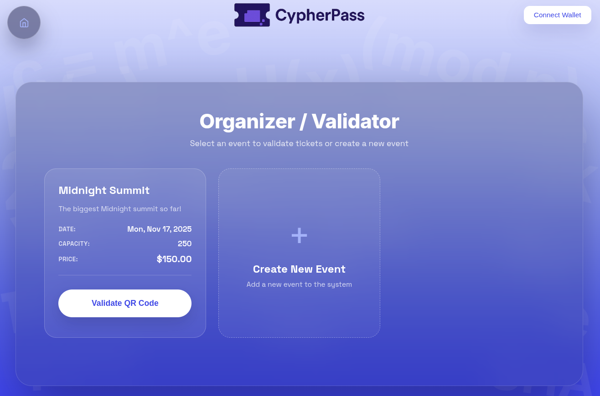
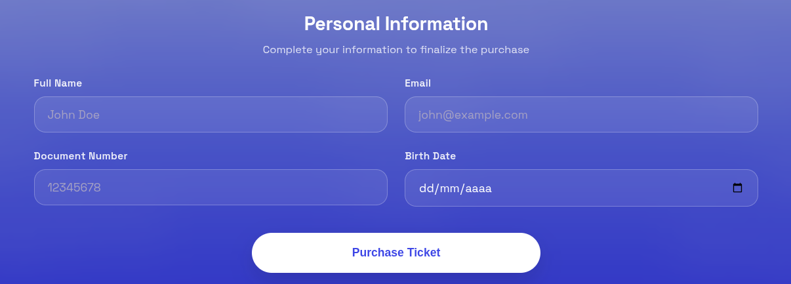
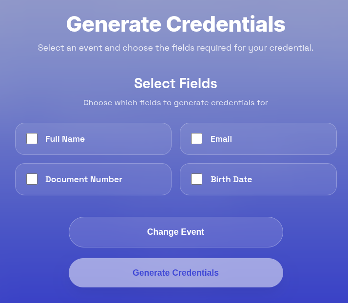
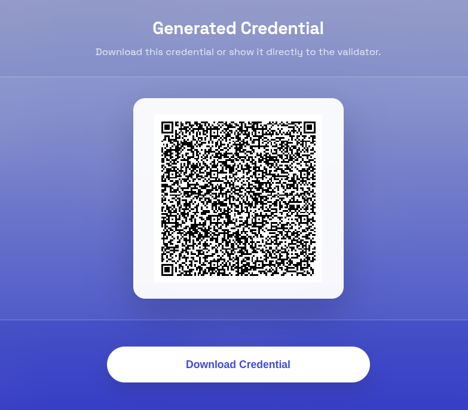

# CypherPass
The following readme didn't use any kind of IA. It was all written by hand by me at 1am.

## Introductory video
You can find it [here](https://drive.google.com/drive/folders/1GtfeXogBiTVZcpU4SiYMjmMV3byZ_x3x).

## Slides
You can find it [here](https://docs.google.com/presentation/d/106aXyx-QP5s17lqpoJu8gsiDDbgUvRSECsaLDkEwy6w).

## Example deployed contract address
0x0200acf4d5d91c602942c427948644bd9da8060e305d51de55ccb800cc61aeed83c7

## Overview
CypherPass is a protocol and application for buying tickets. This is usefull for music shows, congresses and any other event. 

* CypherPass eliminates intermediaries like PassLine, Ticketek, etc. by allowing a smart contract to process the purchases.
* CypherPass prevents ticket re-selling by associating a ticket with credential identity, like National ID, Passport or email.
* CypherPass doesn't show anyone (not even the event organizer) who's the buyer and attendee.
* The user only reveals the required data (National ID) at the venue, required by a validator at the moment of check-in.

This application is meant for 3 kinds of user:
* The Event Organizer (or just **Organizer**): it creates and publishes the event.
* The buyer, client or **atendee**: it buys the ticket and presents it at the venue for the check-in.
* The **validator**: works for the venue and validates the atendees' tickets.



We have a vision where no one has your location beforehand, or has to know more than the absolute necessary for you to access somewhere. Not having intermediaries also is an important source of privacy since you don't have to give personal information to a third party.

## Protocol detail
1) The Organizer creates an **event**. An Event is defined by:
    * Name and description
    * Necessary client data (like full name, government id, passport, birth date or email). Note: not all of this data is necessarily gonna be disclosed.
    * Amount of aviable spaces. A more complex and future implementation includes different kind of venue locations (field, F23, etc.).
    * Price

On the backend, this is going to deploy a Midnight smart contract with an owner (the creator of the event). This smart contract contains all the data relevant to the event, and the logic to manage the interactions that will be explained in the next sections. The important thing to have in mind is that the contract address must be published for everyone to see and buy tickets. 



2) 

The client enters the publisher's page and finds the corresponding event (there might be more than one). Another option is that there's a hub of events where the clients can see events published by many organizers. By ckicking the desired event, the client will find a form with all the personal data needed to buy the ticket. This data will not be published on the public ledger or leave the user device whatsoever.



After filling this form, the client will do 2 things:
* Create a Merkle Tree on the client side. The leafs are the client data, in the order declared by the event (hence by the contract). A future implementation could improve security by mixing a secret salt along with each piece of information. 
* Create a transaction meant to be validated by the event's contract. This transaction does 3 things:
    * Subscribe the Merkle Root of the ticket to the public ledger. This will be used in the validation phase. This is a representation of the "secretly bought tickets for the event". Note: in a future version the ideal is that the contract itself creates the Merkle Tree. This is because you might want to validate some fields, instead of letting the client-side choose everything. 
    * Pay for the ticket.
    * Subtract 1 from the available tickets (and fail if such amount is already 0).

The ticket as such is composed by the client data, along with the event ID. However, from the validator's point of view, the ticket is the Merkle Root present in the public ledger. 

3) The atendee arrives to the event. The validator in the door asks for some kind of identification. The atendee and the validator agree in the data that is required (for example, the atendee might only want to disclose their ID but not their email). They both pick in their sides of the app the fields that should be disclosed.



On the atendee's side, this will do the following:
* Create a Merkle Path for each of piece of disclosed information
* Generate a QR code that contains the plain value and the merkle path for each disclosed piece of information, along with the Merkle Root.



On the validator's side, this will open a camera to scan the atendee's QR code. The validation will succeed when all the Merkle Paths have been checked. But this is not enough: the validator also has to check that the ticket is on the public ledger, and mark it as used. 

Only certain people can do this verification to avoid a malicious user to mark unused tickets as used, so the contract owner should also have the possibility to grant that role to one or many addresses. 


## Run on a local environment
Just run

```cd frontend && npm install && npm run dev```

The proof server must be up and running. 
